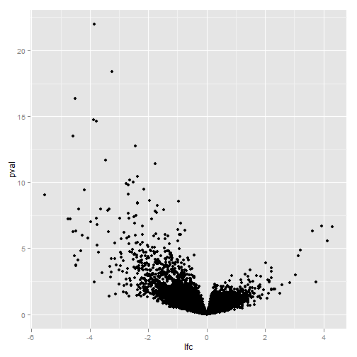
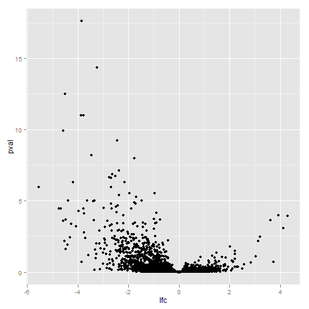

# Microarray Lab

Current arrays used (including Affymetrix(r) and Agilent(r)) tend to have no 
problems with finding and calculating spot intensities. Therefore, this lab will 
concentrate on exploring data from public databases and performing a basic analysis
using open-source tools such as [`Bioconductor`](http://bioconductor.org).

## Exploration

## Websites

Currently DNA microarray data is deposited in 
 * [GEO](http://www.ncbi.nlm.nih.gov/geo/) 
 * [ArrayExpress](http://www.ebi.ac.uk/arrayexpress/)
 
These both provide a rich source of raw data for analysis. You should spend some time looking at the websites. 

Can we answer some basic questions about the number of data sets in each database?

* How many platforms?
* How many experiments (series)?
* How many samples?
* How many curated datasets?
* How many organisms represented?

How hard is this information to get via the web-site?


### Series

Use the [browse link](www.ncbi.nlm.nih.gov/geo/browse/) to look at the various data sets in 
many different ways. How hard is it to find a diabetes `Series` study that uses human samples, that has CEL files available?


### GPL

The official `GPL` for the Affymetrix(r) human U133 Plus 2.0 genome chip is [`GPL570`](http://www.ncbi.nlm.nih.gov/geo/query/acc.cgi?acc=GPL570).
However, there are a lot **alternative** platforms. Can you find them all browsing for 
`Platforms`? 


### Datasets

`Datasets` are curated experiments at GEO, that allow investigation of gene expression levels
as well as perform basic analyses using on-line tools. We will use the online tools available at GEO to examine [GDS3324](http://www.ncbi.nlm.nih.gov/sites/GDSbrowser?acc=GDS3324). 

What genes come up as different based on tissue and condition? Hint, there is a link on the 
analysis page.

Pick an analysis to perform. How many genes come up as differentially expressed? Are any of these the control probesets on the chip?
 

### Bioconductor

[`Bioconductor`](http://bioconductor.org) is a set of `R` libraries specifically
developed for high-throughput biological analysis
 * Originally geared towards DNA microarray
 * Now moving more into other -omics and RNASeq
 
You should have downloaded the **CEL** data for the **GSE** corresponding to [GDS3324](http://www.ncbi.nlm.nih.gov/geosuppl/?acc=GSE10797). Use `tar` or [`7zip`](http://www.7-zip.org) to extract
the files to a directory.

Our goal is to use a standard Bioconductor workflow to process the data and get a list of genes
out. Possibly in another lab we will examine the genes for enrichment.

### GEOmetadb

All of the meta-information that was searchable on the GEO website, is also contained in the 
GEO metadb sqlite database. We can explore it offline in Bioconductor using SQL.


```r
require(GEOmetadb)
```

```
## Loading required package: GEOmetadb
```

```
## Loading required package: GEOquery
```

```
## Loading required package: Biobase
```

```
## Loading required package: BiocGenerics
```

```
## Attaching package: 'BiocGenerics'
```

```
## The following object(s) are masked from 'package:stats':
## 
## xtabs
```

```
## The following object(s) are masked from 'package:base':
## 
## anyDuplicated, cbind, colnames, duplicated, eval, Filter, Find, get,
## intersect, lapply, Map, mapply, mget, order, paste, pmax, pmax.int, pmin,
## pmin.int, Position, rbind, Reduce, rep.int, rownames, sapply, setdiff,
## table, tapply, union, unique
```

```
## Welcome to Bioconductor
## 
## Vignettes contain introductory material; view with 'browseVignettes()'. To
## cite Bioconductor, see 'citation("Biobase")', and for packages
## 'citation("pkgname")'.
```

```
## Setting options('download.file.method.GEOquery'='auto')
```

```
## Loading required package: RSQLite
```

```
## Loading required package: DBI
```

```r
con <- dbConnect("SQLite", "GEOmetadb.sqlite")
dbListTables(con)
```

```
##  [1] "gds"               "gds_subset"        "geoConvert"       
##  [4] "geodb_column_desc" "gpl"               "gse"              
##  [7] "gse_gpl"           "gse_gsm"           "gsm"              
## [10] "metaInfo"          "sMatrix"          
```

```r

dbListFields(con, "gsm")
```

```
##  [1] "ID"                     "title"                 
##  [3] "gsm"                    "series_id"             
##  [5] "gpl"                    "status"                
##  [7] "submission_date"        "last_update_date"      
##  [9] "type"                   "source_name_ch1"       
## [11] "organism_ch1"           "characteristics_ch1"   
## [13] "molecule_ch1"           "label_ch1"             
## [15] "treatment_protocol_ch1" "extract_protocol_ch1"  
## [17] "label_protocol_ch1"     "source_name_ch2"       
## [19] "organism_ch2"           "characteristics_ch2"   
## [21] "molecule_ch2"           "label_ch2"             
## [23] "treatment_protocol_ch2" "extract_protocol_ch2"  
## [25] "label_protocol_ch2"     "hyb_protocol"          
## [27] "description"            "data_processing"       
## [29] "contact"                "supplementary_file"    
## [31] "data_row_count"         "channel_count"         
```


We can do similar sorts of queries using the SQLite database as we did on the website.

However, some of the information is not linked the same way in GEOmetadb. For example, it is
easy to find **datasets** related to human diabetes, but more complicated to find **series**, 
because the organism is *not* part of the series table. However, we can exploit the fact that 
**GSE** is included in the **GSM** table.


```r
# Can easily find datasets for human diabetes
sQ <- "SELECT ID, gds, description, type, sample_organism FROM gds WHERE description LIKE '%diabetes%' AND sample_organism='Homo sapiens'"
dbRes <- dbGetQuery(con, sQ)
dbRes
```

```
##      ID     gds
## 1    73  GDS157
## 2    74  GDS158
## 3    75  GDS160
## 4    76  GDS161
## 5    77  GDS162
## 6  1982 GDS2790
## 7  1983 GDS2791
## 8  2236 GDS3104
## 9  2304 GDS3181
## 10 2411 GDS3347
## 11 2662 GDS3656
## 12 2671 GDS3665
## 13 2687 GDS3681
##                                                                                                                                                                                                                                                                                                   description
## 1                                                                                         Analysis of gene expression in pooled vastus lateralis muscle samples from insulin-sensitive and insulin-resistant equally obese, non-diabetic Pima Indians. A search for susceptibility genes for type 2 diabetes.
## 2                                                                                         Analysis of gene expression in pooled vastus lateralis muscle samples from insulin-sensitive and insulin-resistant equally obese, non-diabetic Pima Indians. A search for susceptibility genes for type 2 diabetes.
## 3                                                                                         Analysis of gene expression in pooled vastus lateralis muscle samples from insulin-sensitive and insulin-resistant equally obese, non-diabetic Pima Indians. A search for susceptibility genes for type 2 diabetes.
## 4                                                                                         Analysis of gene expression in pooled vastus lateralis muscle samples from insulin-sensitive and insulin-resistant equally obese, non-diabetic Pima Indians. A search for susceptibility genes for type 2 diabetes.
## 5                                                                                         Analysis of gene expression in pooled vastus lateralis muscle samples from insulin-sensitive and insulin-resistant equally obese, non-diabetic Pima Indians. A search for susceptibility genes for type 2 diabetes.
## 6                  Analysis of skeletal muscles from non-diabetics after a 3 hour infusion of insulin. Glucose uptake by skeletal muscles in response to insulin is impaired in type 2 diabetes. Results provide insight into the molecular mechanisms regulating glucose homeostasis in response to insulin.
## 7                  Analysis of skeletal muscles from non-diabetics after a 2 hour infusion of insulin. Glucose uptake by skeletal muscles in response to insulin is impaired in type 2 diabetes. Results provide insight into the molecular mechanisms regulating glucose homeostasis in response to insulin.
## 8    Analysis of vastus lateralis muscles from women with insulin-resistant polycystic ovary syndrome (PCOS). Insulin resistance in skeletal muscles is a risk factor for the development of type 2 diabetes in women with PCOS. Results provide insight into the pathogenesis of insulin resistance in PCOS.
## 9       Analysis of skeletal muscles from normal, healthy glucose-tolerant individuals exposed to acute physiological hyperinsulinemia for up to 4 hours. Results suggest a low-grade inflammatory response which may provide insight into the etiology of insulin resistance in type 2 diabetes and obesity.
## 10          Analysis of cultured myotubes from obese patients with type 2 diabetes. Cultured human myotubes display the morphological, metabolic and biochemical properties of adult skeletal muscle. Results provide insight into the molecular mechanisms underlying insulin resistance in skeletal muscle.
## 11 Analysis of endothelial progenitor cells (EPCs) from patients with type 1 diabetes (T1D) before and 4 weeks of dietary folic acid (FA) supplementation. EPCs are involved in vascular wall repair. T1D results in reduced circulating EPCs. Results provide insight into the effect of FA on EPC function.
## 12                                                                                                                                                    Analysis of visceral adipose omentum tissues of obese women with type 2 diabetes mellitus. Age and BMI-matched glucose-tolerant women used as controls.
## 13    Analysis of myotube cell lines established from type 2 diabetes (T2D) subjects. Insulin resistance and reduced mitochondrial biogenesis coexist early in T2D pathogenesis independent of hyperglycemia and obesity. Results provide insight into the effect of T2D on developing skeletal muscle cells.
##                             type sample_organism
## 1  Expression profiling by array    Homo sapiens
## 2  Expression profiling by array    Homo sapiens
## 3  Expression profiling by array    Homo sapiens
## 4  Expression profiling by array    Homo sapiens
## 5  Expression profiling by array    Homo sapiens
## 6  Expression profiling by array    Homo sapiens
## 7  Expression profiling by array    Homo sapiens
## 8  Expression profiling by array    Homo sapiens
## 9  Expression profiling by array    Homo sapiens
## 10 Expression profiling by array    Homo sapiens
## 11 Expression profiling by array    Homo sapiens
## 12 Expression profiling by array    Homo sapiens
## 13 Expression profiling by array    Homo sapiens
```

```r

sQ_gse <- "SELECT gse FROM gse WHERE title LIKE '%diabetes%'"
db_gse <- dbGetQuery(con, sQ_gse)
head(db_gse)
```

```
##       gse
## 1   GSE11
## 2  GSE121
## 3  GSE634
## 4 GSE1085
## 5 GSE1659
## 6 GSE1979
```

```r

gseSrch <- paste("'", db_gse$gse, "'", sep = "")
gseSrch <- paste(gseSrch, collapse = ",", sep = "")
gseSrch <- paste("(", gseSrch, ")", sep = "", collapse = "")
sQ_gsm <- paste("SELECT * FROM gsm WHERE series_id IN ", gseSrch, " AND organism_ch1 IN ('Homo sapiens')", 
    sep = "", collapse = "")
db_gsm <- dbGetQuery(con, sQ_gsm)
head(db_gsm)
```

```
##      ID                                 title      gsm series_id     gpl
## 1  5675 Regulated genes in diabetic placentas  GSM6154   GSE2956  GPL310
## 2  8969                             P1 slide1  GSM9690    GSE634  GPL120
## 3  8970                   P1 Cy5/Cy3 post/pre  GSM9691    GSE634  GPL120
## 4  8984                             P2 Slide1  GSM9705    GSE634  GPL120
## 5  8985                             P2 Slide2  GSM9706    GSE634  GPL120
## 6 81595                              P2-3_N-3 GSM94202   GSE4117 GPL1708
##                  status submission_date last_update_date    type
## 1 Public on Apr 30 2003      2003-04-27       2005-05-27     RNA
## 2 Public on Mar 01 2004      2003-09-05       2005-06-16 protein
## 3 Public on Mar 01 2004      2003-09-05       2005-06-16 protein
## 4 Public on Mar 01 2004      2003-09-05       2005-06-16 protein
## 5 Public on Mar 01 2004      2003-09-05       2005-06-16 protein
## 6 Public on Jul 29 2006      2006-01-29       2006-01-30     RNA
##   source_name_ch1 organism_ch1
## 1  human placenta Homo sapiens
## 2    presentation Homo sapiens
## 3       remission Homo sapiens
## 4    presentation Homo sapiens
## 5       remission Homo sapiens
## 6            P2-3 Homo sapiens
##                                                          characteristics_ch1
## 1                                                                       <NA>
## 2                                                                       <NA>
## 3                                                                       <NA>
## 4                                                                       <NA>
## 5                                                                       <NA>
## 6 before comedy show, patients with type 2 diabetes (diabetic nephropathy +)
##   molecule_ch1 label_ch1 treatment_protocol_ch1 extract_protocol_ch1
## 1    total RNA      <NA>                   <NA>                 <NA>
## 2      protein      <NA>                   <NA>                 <NA>
## 3      protein      <NA>                   <NA>                 <NA>
## 4      protein      <NA>                   <NA>                 <NA>
## 5      protein      <NA>                   <NA>                 <NA>
## 6    total RNA       Cy5                   <NA>                 <NA>
##   label_protocol_ch1 source_name_ch2 organism_ch2
## 1               <NA>  human placenta Homo sapiens
## 2               <NA>       remission Homo sapiens
## 3               <NA>    presentation Homo sapiens
## 4               <NA>       remission Homo sapiens
## 5               <NA>    presentation Homo sapiens
## 6               <NA>             N-3 Homo sapiens
##                  characteristics_ch2 molecule_ch2 label_ch2
## 1                               <NA>    total RNA      <NA>
## 2                               <NA>      protein      <NA>
## 3                               <NA>      protein      <NA>
## 4                               <NA>      protein      <NA>
## 5                               <NA>      protein      <NA>
## 6 before comedy show, normal subject    total RNA       Cy3
##   treatment_protocol_ch2 extract_protocol_ch2 label_protocol_ch2
## 1                   <NA>                 <NA>               <NA>
## 2                   <NA>                 <NA>               <NA>
## 3                   <NA>                 <NA>               <NA>
## 4                   <NA>                 <NA>               <NA>
## 5                   <NA>                 <NA>               <NA>
## 6                   <NA>                 <NA>               <NA>
##   hyb_protocol
## 1         <NA>
## 2         <NA>
## 3         <NA>
## 4         <NA>
## 5         <NA>
## 6         <NA>
##                                                                         description
## 1 Quantitative modifications of up- and down-regulated genes in diabetic placentas.
## 2    P1 Slide 1 labelled Cy5/Cy3 presentation/remission;\tLot batch = Lot 2090032-52
## 3              Muscle P1 Cy5/Cy3 remission/presentation;\tLot batch = Lot 2090032-53
## 4                Slide 1 P2 Cy5/Cy3 presentation/remission;\tLot batch = Lot 2090032
## 5                 Slide2 P2 Cy5/Cy3 remission/presentation;\tLot batch = Lot 2090032
## 6                                                   Sample Tissue: peripheral blood
##                   data_processing
## 1                            <NA>
## 2                            <NA>
## 3                            <NA>
## 4                            <NA>
## 5                            <NA>
## 6 Global Normalization and Lowess
##                                                                                                                                                                                                                                                                                                                                                     contact
## 1                                                                                             Name: Sylvie Hauguel-de Mouzon;\tEmail: sdemouzon@aol.com;\tPhone: 33 1 44 27 65 31;\tLaboratory: UPRES 2396;\tDepartment: Hopital Saint Antoine;\tInstitute: Universite Paris6;\tAddress: 24 rue de Chaligny;\tCity: Paris;\tZip/postal_code: 75012;\tCountry: France
## 2                                                                         Name: Donald,B.,Thomason;\tEmail: thomason@physio1.utmem.edu;\tPhone: 901-448-7224;\tFax: 901-448-7126;\tDepartment: Physiology;\tInstitute: The University of Tennessee Health Science Center;\tAddress: 894 Union Ave;\tCity: Memphis;\tState: TN;\tZip/postal_code: 38163;\tCountry: USA
## 3                                                                         Name: Donald,B.,Thomason;\tEmail: thomason@physio1.utmem.edu;\tPhone: 901-448-7224;\tFax: 901-448-7126;\tDepartment: Physiology;\tInstitute: The University of Tennessee Health Science Center;\tAddress: 894 Union Ave;\tCity: Memphis;\tState: TN;\tZip/postal_code: 38163;\tCountry: USA
## 4                                                                         Name: Donald,B.,Thomason;\tEmail: thomason@physio1.utmem.edu;\tPhone: 901-448-7224;\tFax: 901-448-7126;\tDepartment: Physiology;\tInstitute: The University of Tennessee Health Science Center;\tAddress: 894 Union Ave;\tCity: Memphis;\tState: TN;\tZip/postal_code: 38163;\tCountry: USA
## 5                                                                         Name: Donald,B.,Thomason;\tEmail: thomason@physio1.utmem.edu;\tPhone: 901-448-7224;\tFax: 901-448-7126;\tDepartment: Physiology;\tInstitute: The University of Tennessee Health Science Center;\tAddress: 894 Union Ave;\tCity: Memphis;\tState: TN;\tZip/postal_code: 38163;\tCountry: USA
## 6 Name: Toshiro Saito;\tEmail: toshiro@ls.hitachi.co.jp;\tPhone: +81-49-238-3529;\tFax: +81-49-238-3240;\tLaboratory: Biotechnology Center;\tDepartment: Life Science Group;\tInstitute: Hitachi, Ltd.;\tAddress: 1-3-1;\tCity: Minamidai, Kawagoe;\tState: Saitama;\tZip/postal_code: 350-1165;\tCountry: Japan;\tWeb_link: http://www.hitachi.co.jp/LS/eng/index.html
##   supplementary_file data_row_count channel_count
## 1                               435             2
## 2                               768             2
## 3                               768             2
## 4                               768             2
## 5                               768             2
## 6                             41675             2
```

```r
dim(db_gsm)
```

```
## [1] 1044   32
```

```r
length(unique(db_gsm$series_id))
```

```
## [1] 27
```


Now what about all of the series that are attached to Affymetrix HGU 133 plus 2.0 arrays?


```r
gplQ <- "SELECT gpl FROM gpl WHERE title LIKE '%U133 plus 2.0%'"
gplRes <- dbGetQuery(con, gplQ)
```


Disconnect database when done.


```r
dbDisconnect(con)
```

```
## [1] TRUE
```


### Differential Expression Analysis

Using the data downloaded previously and `Bioconductor` functions, we will attempt to determine
those genes that are differentially expressed. 


```r
# set default compression on saves, and don't use *Factors* in data frames
options(stringsAsFactors = FALSE)
require(affy)
```

```
## Loading required package: affy
```

```r
require(genefilter)
```

```
## Loading required package: genefilter
```

```r
require(limma)
```

```
## Loading required package: limma
```

```r
require(arrayQualityMetrics)
```

```
## Loading required package: arrayQualityMetrics
```

```r
require(ggplot2)
```

```
## Loading required package: ggplot2
```

```r
require(hgu133a2.db)
```

```
## Loading required package: hgu133a2.db
```

```
## Loading required package: AnnotationDbi
```

```
## Loading required package: org.Hs.eg.db
```

```
## 
```

```
## 
```


#### Read Data


```r
# not evaluated because it takes a long time on my 2GB Ram machine
celDir <- "GSE10797_RAW"
setwd(celDir)
celDat <- read.affybatch(filenames = dir())

celDat
setwd("..")
```


Unfortunately, this method makes it difficult to know which samples belong to which class
(cancer, normal, stroma, epithelial, etc). We can use the `GEOmetadb` to get this information, 
however. This is required to enable proper analysis of the data.

#### Sample Info


```r
con <- dbConnect("SQLite", "GEOmetadb.sqlite")
getDat <- dbGetQuery(con, "select title, gsm, series_id from gsm where series_id in ('GSE10797')")
splitSample <- strsplit(getDat$title, "_", fixed = T)
head(splitSample)
getDat$cancerType <- sapply(splitSample, function(x) {
    x[1]
})
head(getDat)
getDat$tissueType <- sapply(splitSample, function(x) {
    x[2]
})
getDat$replicate <- sapply(splitSample, function(x) {
    x[3]
})
head(getDat)
tmpDat <- pData(celDat)
class(tmpDat)
getDat <- getDat[order(getDat$gsm), ]
tail(getDat)
head(getDat)
head(tmpDat)
tmpDat <- cbind(tmpDat, getDat)
pData(celDat) <- tmpDat

.sessionInfo <- sessionInfo()
.timedate <- Sys.time()
save(celDat, .sessionInfo, .timedate, file = "celData.RData")
rm(list = ls())
```


#### RMA Summarize

`RMA` is one of the more popular methods for summarizing Affymetrix(r) GeneChip(r) data. 
It only uses the **PM** probes, models probe behavior to do background correction, quantile
normalization to force identical signal distributions, and then a median-polish to average
the probe signals and generate a final value.


```r
load("celData.RData")
rmaDat <- rma(celDat)
```

```
## 
```

```
## Background correcting
## Normalizing
## Calculating Expression
```

```r
.sessionInfo <- sessionInfo()
.timedate <- Sys.time()
save(.sessionInfo, .timedate, rmaDat, file = "rmaData.RData")
```


#### Quality Control


```r
# this also takes a long time, the files are in the git repo.
arrayQualityMetrics(celDat, outdir = "rawData", do.logtransform = T, spatial = F, 
    intgroup = c("tissueType", "cancerType"), force = T)
arrayQualityMetrics(rmaDat, outdir = "rmaData", do.logtransform = F, intgroup = c("tissueType", 
    "cancerType"), force = T)
```


You should explore the ArrayQualityMetrics reports ([celDat](rawData/index.html), [rmaDat](rmaData/index.html) ) to see what types of things get reported, and how some discrepancies
are resolved due to normalization. 


```r
rm(celDat)
```


#### ProbeSet Filtering

There are two opinions on filtering before diff. expression analysis. 
 
 1. Filter out the controls
 2. Filter out everything that may be irrelevent, including probesets with low variance and those that don't map to known genes
 
Due to personal experience, and known issues with skewing results due to changing the numbers
for multiple testing adjustment, I prefer **1**, filtering out as few items as required.


```r
rmaFilt <- featureFilter(rmaDat, require.entrez = FALSE, remove.dupEntrez = FALSE, 
    feature.exclude = "^AFFX")
rmaInt <- exprs(rmaFilt)  # get the actual probeset intensities
```


#### Design Setup

We want to be able to compare between the cancer and normal of each cell type, much like
the original [paper](fulltext.pdf). So we will generate a new variable that is a combination
of disease status and tissue, and use this in our design matrix.


```r
pD <- pData(rmaDat)
pD$cancer.tissue <- paste(pD$cancerType, pD$tissueType, sep = ".")

f <- factor(pD$cancer.tissue, levels = unique(pD$cancer.tissue))
design <- model.matrix(~0 + f)
colnames(design) <- c("CE", "CS", "NE", "NS")

rm(rmaDat, rmaFilt)
```


#### Limma

We are using the `limma` package for the diff. expression analysis. `limma` allows one to 
use bayesian methods to *borrow* variance information between genes / probesets. When the 
number of samples is large (say 20 or more), the variance estimates don't change between
borrowing and not. However, when the number of samples is small (say 3 - 5 in each class),
this can be much more important.

`limma` has become a de-facto standard in the analysis of DNA microarrays, and that is
partly why we use it here. We could also do a standard t-test, permuted t-tests, and lots
of other things that have appeard in the literature.


```r
fit <- lmFit(rmaInt, design)
contrast.matrix <- makeContrasts("CE - NE", "CS - NS", levels = design)

fit2 <- contrasts.fit(fit, contrast.matrix)
fit2 <- eBayes(fit2)
```


The package provides some very nice functions to summarize the results. `decideTests` is one
that provides a summary of the number of significant probesets / genes in each contrast.


```r
testRes <- decideTests(fit2)
sum(testRes[, "CE - NE"] == 1)
```

```
## [1] 9
```

```r
sum(testRes[, "CE - NE"] == -1)
```

```
## [1] 232
```

```r
sum(testRes[, "CS - NS"] == -1)
```

```
## [1] 39
```

```r
sum(testRes[, "CS - NS"] == 1)
```

```
## [1] 7
```


However, `topTable` is probably the normal way you would get access to all the data you 
would want to investigate the results. In this example, we will get all of the results so
we can plot some things.


```r
ce.ne <- topTable(fit2, coef = "CE - NE", number = Inf, adjust.method = "BH", 
    p.value = 1)
dim(ce.ne)
```

```
## [1] 22215     7
```

```r
head(ce.ne)
```

```
##                ID  logFC AveExpr       t   P.Value adj.P.Val     B
## 22200      823_at -3.847   3.022 -15.024 1.087e-22 2.414e-18 38.57
## 3214    203687_at -3.234   2.936 -12.680 3.875e-19 4.304e-15 31.50
## 4578  205051_s_at -4.499   3.693 -11.408 4.390e-17 3.251e-13 27.31
## 19789 220425_x_at -3.869   3.198 -10.437 1.847e-15 1.019e-11 23.95
## 5979  206453_s_at -3.768   4.229 -10.381 2.292e-15 1.019e-11 23.76
## 21156   221796_at -4.567   3.385  -9.719 3.116e-14 1.154e-10 21.39
```


Lets look at the relationship between fold-change and p-value.


```r
plotDat <- data.frame(lfc = ce.ne$logFC, pval = -1 * log10(ce.ne$P.Value))
ggplot(plotDat, aes(x = lfc, y = pval)) + geom_point()
```

 

```r

plotDat2 <- data.frame(lfc = ce.ne$logFC, pval = -1 * log10(ce.ne$adj.P.Val))
ggplot(plotDat2, aes(x = lfc, y = pval)) + geom_point()
```

 


#### Gene IDs

Can we figure out which genes are diff. expressed? 


```r
ce.ne.Diff <- ce.ne[(ce.ne$adj.P.Val <= 0.05), ]
ce.ne.Diff$Entrez <- unlist(mget(ce.ne.Diff$ID, hgu133a2ENTREZID, ifnotfound = NA))
```


See some `NA` values. i.e. there is no corresponding Entrez Gene. But Affymetrix(r) doesn't
tend to have probesets for no reason. What else could it be?


```r
ce.ne.Diff$ACC <- unlist(mget(ce.ne.Diff$ID, hgu133a2ACCNUM, ifnotfound = NA))
head(ce.ne.Diff)
```

```
##                ID  logFC AveExpr       t   P.Value adj.P.Val     B Entrez
## 22200      823_at -3.847   3.022 -15.024 1.087e-22 2.414e-18 38.57   6376
## 3214    203687_at -3.234   2.936 -12.680 3.875e-19 4.304e-15 31.50   6376
## 4578  205051_s_at -4.499   3.693 -11.408 4.390e-17 3.251e-13 27.31   3815
## 19789 220425_x_at -3.869   3.198 -10.437 1.847e-15 1.019e-11 23.95   <NA>
## 5979  206453_s_at -3.768   4.229 -10.381 2.292e-15 1.019e-11 23.76  57447
## 21156   221796_at -4.567   3.385  -9.719 3.116e-14 1.154e-10 21.39   4915
##             ACC
## 22200    U84487
## 3214  NM_002996
## 4578  NM_000222
## 19789 NM_017578
## 5979  NM_016250
## 21156  AA707199
```


Ok, so they definitely come from somewhere. Those are really big p-values (even adjusted),
what does the raw data look like? i.e. just how different are they on the probe-scale?


```r
rm(fit, fit2, rmaInt, plotDat, plotDat2)
load("celData.RData")

pmInt <- pm(celDat)
useProbe <- indexProbes(celDat, which = "pm", genenames = "823_at")

useInt <- log2(pmInt[as.character(useProbe[[1]]), ])
rm(pmInt)

ceIndx <- as.logical(design[, "CE"])
neIndx <- as.logical(design[, "NE"])

ceInt <- useInt[, ceIndx]
neInt <- useInt[, neIndx]
```

